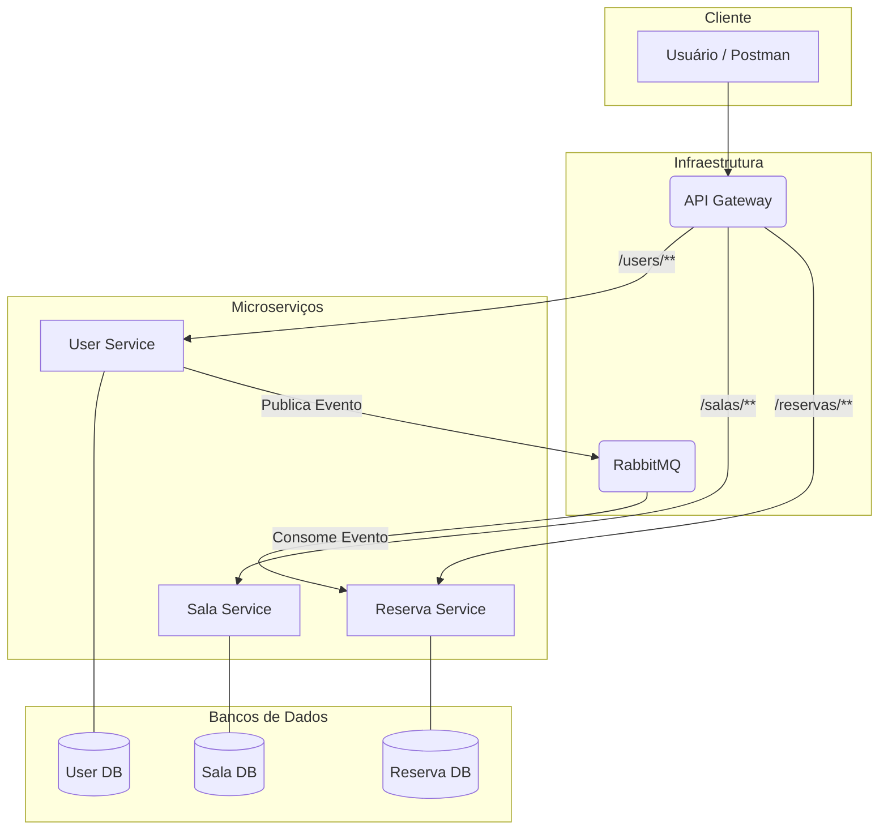

# 🚀 Sistema de Reserva de Salas com Microserviços


Este projeto demonstra a implementação de um sistema de reserva de salas utilizando uma arquitetura de microserviços desacoplados. O objetivo é aplicar conceitos modernos de desenvolvimento de software, como comunicação assíncrona, conteinerização e um ponto de entrada único através de um API Gateway.

## ✨ Arquitetura do Sistema

O diagrama abaixo ilustra a interação entre os componentes do sistema:



## Core Concepts

* **Microserviços:** Cada serviço possui uma única responsabilidade (Single Responsibility Principle) e seu próprio banco de dados, garantindo autonomia e escalabilidade.
* **API Gateway:** O serviço `gateway` atua como um ponto de entrada único (`Single Point of Entry`), simplificando o consumo da API e centralizando a configuração de rotas e CORS.
* **Comunicação Assíncrona:** O `user-service` notifica outros serviços sobre a criação e alteração de usuários através do RabbitMQ. Isso desacopla os serviços, de modo que o `reserva-service` não precisa se comunicar diretamente com o `user-service`.
* **Containerização:** Todo o ambiente, incluindo os serviços, bancos de dados e o message broker, é orquestrado pelo Docker Compose, garantindo consistência e facilidade na execução.
* **CRUD APIs:** Full CRUD operations for all main resources.

## 🛠️ Tecnologias Utilizadas

* **Linguagem:** Java 17
* **Framework:** Spring Boot 3.2.5
* **Componentes Spring:** Spring Web, Spring Data JPA, Spring AMQP, Spring Cloud Gateway
* **Banco de Dados:** PostgreSQL (um por serviço)
* **Mensageria:** RabbitMQ
* **Container:** Docker & Docker Compose
* **Build Tool:** Maven
* **Utilitários:** Lombok

## 🚀 Como Executar o Projeto

### Pré-requisitos
* [Docker](https://www.docker.com/get-started)
* [Docker Compose](https://docs.docker.com/compose/install/)
* [Git](https://git-scm.com/)

### Passos
1.  **Clone o repositório:**
    >```sh
    >git clone [https://github.com/KronosZbr/Reservas_Salas_Final.git](https://github.com/KronosZbr/Reservas_Salas_Final.git)
    >```
2.  **Navegue até a pasta raiz do projeto:**
    ```sh
    cd Reservas_Salas_Final
    ```
3.  **Construa e inicie os containers:**
    ```sh
    docker-compose up --build
    ```
4.  **Pronto!** O ambiente estará disponível nos seguintes endereços:
    * **API Gateway:** `http://localhost:8080`
    * **RabbitMQ Management:** `http://localhost:15672` (login: `admin`/`admin`)
    * **Adminer (Gerenciador de Banco):** `http://localhost:8090`

## Endpoints da API

Todas as requisições devem ser feitas para o API Gateway (`http://localhost:8080`).

| Método   | Endpoint                  | Descrição                           |
| :------- | :------------------------ | :---------------------------------- |
| `POST`   | `/users`                  | Cria um novo usuário.               |
| `GET`    | `/users`                  | Lista todos os usuários.            |
| `PUT`    | `/users/{id}`             | Atualiza um usuário existente.      |
| `DELETE` | `/users/{id}`             | Deleta um usuário.                  |
| `POST`   | `/salas`                  | Cria uma nova sala.                 |
| `GET`    | `/salas`                  | Lista todas as salas.               |
| `PUT`    | `/salas/{id}`             | Atualiza uma sala existente.        |
| `DELETE` | `/salas/{id}`             | Deleta uma sala.                    |
| `POST`   | `/reservas`               | Cria uma nova reserva.              |
| `GET`    | `/reservas`               | Lista todas as reservas.            |
| `PUT`    | `/reservas/{id}`          | Atualiza uma reserva existente.     |
| `DELETE` | `/reservas/{id}`          | Cancela (deleta) uma reserva.       |

### Documentação Interativa (Swagger)
Para uma documentação detalhada e interativa, acesse os seguintes links enquanto a aplicação estiver rodando:
* **User Service:** `http://localhost:8081/swagger-ui.html`
* **Sala Service:** `http://localhost:8082/swagger-ui.html`
* **Reserva Service:** `http://localhost:8083/swagger-ui.html`
